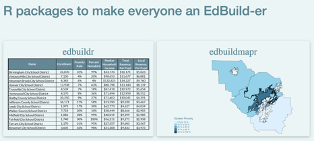

```{r}
#| label: setup
#| include: false
#| file: ../../_slides-setup.R
```

# Welcome! {background-color="#0D525A" .white-text}

## Today's plan

- **10:00–10:15** -- Intro & refresher (you are here!)
- **10:15–10:45** -- Federal-level analysis demo
- **10:45–11:00** -- Break
- **11:00–12:00** -- Independent state analysis
- **12:00–12:30** -- Share out & discussion

::: {.notes}
Welcome fellows back. Acknowledge that they've already worked with edfinr in February -- today's material is all new. Quick orientation to the schedule.
:::

## About Bellwether {background-color="#0D525A" .white-text}

Bellwether envisions a future where *all* young people have access to an [**excellent**]{style="color: #FFB653;"} education, and live lives [**filled with opportunity**]{style="color: #FFB653;"}.

Bellwether is a national nonprofit that works hand in hand with education leaders and organizations to accelerate their impact, inform and influence policy and program design, and share what we learn along the way.

<br>

:::: {.columns}

::: {.column width="20%"}
{style="width: 300px;"}
:::

::: {.column width="50%"}

<br>

**Alex Spurrier**

*Associate Partner* <br>
[Alex.Spurrier@bellwether.org](mailto:Alex.Spurrier@bellwether.org) <br>
[www.linkedin.com/in/alspur](https://www.linkedin.com/in/alspur)
:::


::::

## About Our State School Finance Initiative {background-color="#0D525A" .white-text}

Education finance [**sets the foundation**]{style="color: #FFB653;"} for what is possible in every school in the country. Education finance equity is essential to leveling the playing field for marginalized students in under-resourced schools and communities.

<br>

Bellwether’s work in state education finance equity aims to improve funding systems, state by state, through:

- [**Analyses**]{style="color: #FFB653;"} that shape the public conversation on education finance and help advocates and policymakers understand and improve finance policies in their states.
- [**Trainings**]{style="color: #FFB653;"} that equip state advocates with policy knowledge and data modeling skills to unlock the potential for policy reforms.
- [**Capacity-building**]{style="color: #FFB653;"} support, policy advising, and technical modeling assistance for state advocacy groups or public agencies in states on the precipice of enacting change.


## What is the F-33 survey?

The **Annual Survey of School System Finances** (F-33) is administered by the U.S. Census Bureau on behalf of NCES.

- Covers **all ~13,000 school districts** in the U.S. -- a universe, not a sample
- Revenue by source (local, state, federal) and expenditures by function (instruction, support, capital)
- Form is fairly consistent year-to-year; recent additions include **COVID relief expenditure** tracking
- The **only source** of comparable, highly-detailed LEA-level finance data

<br>

**Sounds great! So what's the catch?**

::: {.notes}
Fuller treatment of the F-33 for AEFP audience members who may not have worked with it directly. Emphasize "universe not sample" and the uniqueness of the data source. The hook at the end sets up the next slide on data messiness.
:::

## It turns out that F-33 data is messy

:::: {.columns}

::: {.column width="40%"}

<br>

{style="width: 500px;"}
:::

:::{.column width="60%"}
<br>

**Census version** issues:

- Revenue and expenditure values need a **×1,000 multiplier**
- C24 state/local revenue adjustment applies in some states
- **No charter school LEAs** included

<br>

**NCES version**: long release lag time

**Analyst judgment** calls everywhere:

- Special-purpose and outlier LEAs
- Pass-through payments and tuition to other systems
- One-time property sales inflating local revenue
:::

::::

::: {.notes}
This motivates why a package like edfinr is valuable -- you don't want every analyst reinventing these cleaning decisions. The Census vs. NCES version distinction is something even experienced F-33 users may not have thought about carefully.
:::

## From EdBuild to edfinr

:::: {.columns}


::: {.column width="60%"}

<br>


- **EdBuild** created `edbuildr` and `edbuildmapr` -- early effort to make F-33 data accessible in R
- After EdBuild's sunset, packages **stopped updating** (data only through SY18)

<br>

- **edfinr** carries on that spirit: opinionated F-33 tidying for policy analysis
- Includes NCES F-33 data **SY12–SY22**

:::

::: {.column width="40%"}

<br>

{style="width: 500px;"}

<br>

{style="width: 300px;"}

:::

::::

::: {.notes}
Brief institutional context. Some AEFP audience members may remember EdBuild or have used edbuildr. The key point is that edfinr picks up where EdBuild left off with updated data and a similar philosophy of making F-33 accessible.
:::

## What is edfinr?

An R package for **tidy education finance data**. Hosted on CRAN:

```r
install.packages("edfinr")
```

Two core functions:

- `get_finance_data()` -- pull cleaned F-33 data by state and year
- `list_variables()` -- explore available variables in skinny and full datasets

Bundles additional data beyond F-33:

- **CCD directory** -- urbanicity, CBSA, congressional districts
- **SAIPE** poverty estimates
- **5-year ACS** via tidycensus -- MHI, median property value, BA+ %

::: {.notes}
Now that the audience understands the problem (messy data) and the lineage (EdBuild → edfinr), this slide presents the solution. Emphasize the CRAN availability and the two main functions they'll use today. The bundled data beyond F-33 is a key differentiator from the old edbuildr.
:::

## `get_finance_data()`

The main function you'll use today:

```{r}
#| eval: false
#| code-line-numbers: "|1|2|3|4"
get_finance_data(
  yr = "2022",            # School year ending (SY2021-22)
  geo = "LA",             # "all" for national, or state code
  dataset_type = "skinny" # "skinny" or "full"
)
```

::: {.notes}
Walk through each argument. Remind them that `yr` refers to the spring year of the school year.
:::

## Skinny vs. full dataset

| | Skinny | Full |
|---|---|---|
| **Variables** | 41 vars | 89 vars |
| **Best for** | Quick analysis, per-pupil comparisons | Deep dives, expenditure breakdowns |
| **Speed** | Fast | Larger download |

In February, we used `"skinny"`. Today we'll also use `"full"` to access **expenditure categories**.

## Key variables (skinny)

| Variable | Description |
|---|---|
| `rev_total_pp` | Total revenue per pupil |
| `rev_local_pp` | Local revenue per pupil |
| `rev_state_pp` | State revenue per pupil |
| `rev_fed_pp` | Federal revenue per pupil |
| `exp_total_pp` | Total expenditure per pupil |
| `enrollment` | Fall enrollment |

::: {.notes}
Quick reference. These are the per-pupil variables they used in the hackathon.
:::

## Quick example

```{r}
#| eval: false
la_finance <- get_finance_data(
  yr = "2022",
  geo = "LA",
  dataset_type = "skinny"
)

la_finance |>
  summarize(
    n_districts = n(),
    median_spending = median(exp_total_pp, na.rm = TRUE),
    median_fed_rev = median(rev_fed_pp, na.rm = TRUE)
  )
```

::: {.notes}
Quick live demo if time permits. Otherwise just walk through the code.
:::

## What's new today

In the hackathon, you:

- Pulled **single-state, skinny** data
- Made scatter plots of district-level spending
- Created a polished chart for LinkedIn

Today, we'll:

- Pull **national, full** data across multiple years
- Analyze **COVID recovery fund spending** patterns
- Do a deeper independent state analysis

## Let's go! {background-color="#0D525A" .white-text}

### Up next: Federal COVID Stimulus Expenditure Analysis
