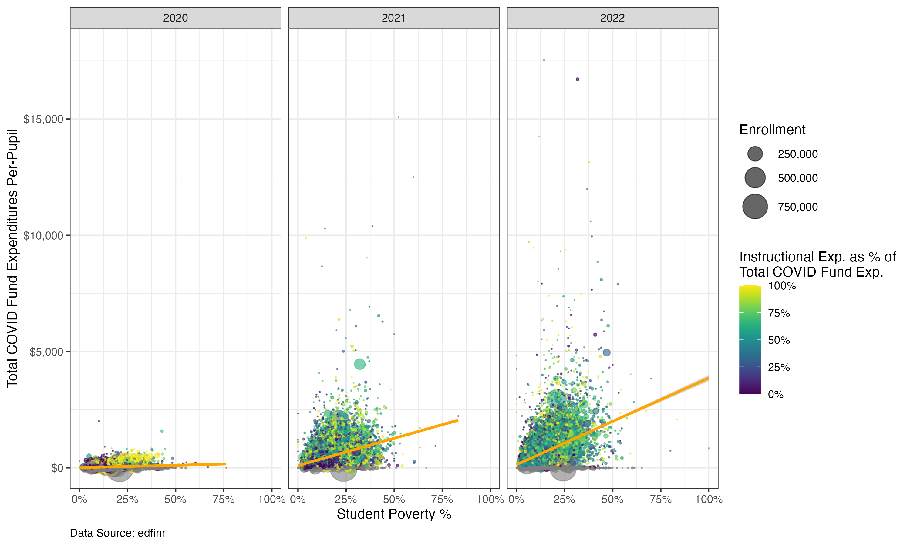
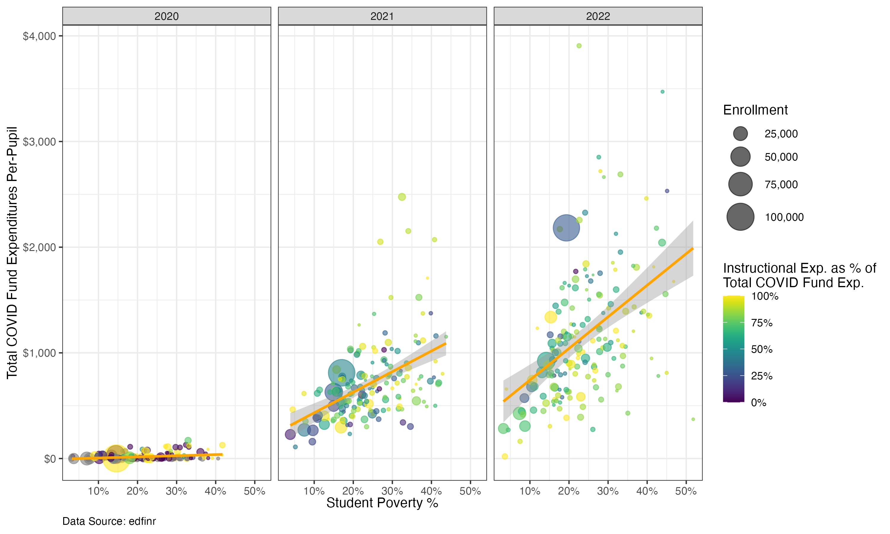

```{r}
#| label: setup
#| include: false
#| file: ../../_slides-setup.R
```

# The story in the data {background-color="#0D525A" .white-text}

## What happened to K-12 funding during COVID?

Congress passed three rounds of **Elementary and Secondary School Emergency Relief** (ESSER) funds:

<br>

| Round | Law | Amount | Deadline |
|---|---|---|---|
| ESSER I | CARES Act (Mar 2020) | $13.2B | Sep 2022 |
| ESSER II | CRRSA Act (Dec 2020) | $54.3B | Sep 2023 |
| ESSER III | ARP Act (Mar 2021) | $122B | Sep 2024 |

<br>

**$190 billion** in new federal K-12 spending -- unprecedented.

::: {.notes}
Set the context. This is more federal money than had ever flowed to K-12 in such a short period. Fellows in education policy should understand the scale.
:::

## How does this show up in F-33 data?

ESSER funds are reported as **federal revenue** in the F-33 survey.

- Districts received allocations based on **Title I formulas**
- Spending was flexible: instruction, tutoring, HVAC, mental health, staffing
- The F-33 captures when districts **spent** the money, not when it was allocated

This means we can track the **spending timeline** across years.

## Our analysis plan

1. Pull multi-year pandemic-era data via `edfinr`
2. `select()` key variables for analysis
3. Calculate per-pupil expenditures with `across()`
4. Explore COVID spending vs. student poverty via `ggplot2`
5. `filter()` to a single state for deeper analysis

# Getting the data {background-color="#0D525A" .white-text}

## Pulling pandemic-era data

edfinr's `yr` argument accepts a **range string** — no need for `map()`:

```{r}
#| eval: false
#| code-line-numbers: "|2|3"
covid_yrs <- get_finance_data(
  yr = "2020:2022",
  dataset_type = "full"
)
```

- `"2020:2022"` pulls SY2019-20 through SY2021-22 in one call
- Omitting `geo` defaults to **national** (all districts)
- `dataset_type = "full"` gives us detailed expenditure categories and demographics

::: {.notes}
In the hackathon, fellows used single-year pulls with `map()`. Show how the range syntax is simpler. The full dataset is a larger download but gives us the COVID-specific expenditure variables we need.
:::

## Selecting variables for analysis

The full dataset has hundreds of columns. Let's pick what we need:

```{r}
#| eval: false
#| code-line-numbers: "|3-4|5-6|7-8|9-10"
covid_exp <- covid_yrs |>
  select(
    # identifiers and enrollment
    ncesid, year, state, cbsa, cong_dist, dist_name, enroll,
    # revenue per-pupil
    rev_total_pp, rev_local_pp, rev_state_pp, rev_fed_pp,
    # socio-economic variables
    mhi, mpv, ba_plus_pct, stpov_pct, urbanicity,
    # expenditure data
    exp_cur_total, exp_covid_total, exp_covid_instr
  )
```

Note the **COVID-specific** expenditure columns: `exp_covid_total` and `exp_covid_instr`. These track ESSER spending separately from general expenditures.

::: {.notes}
Walk through the column groups. The socio-economic variables (`stpov_pct`, `mhi`, `urbanicity`) are what make the full dataset valuable — they let us ask equity questions about who got the money.
:::

## Calculating per-pupil expenditures

The expenditure columns are **totals**, not per-pupil. We'll use `across()` to convert all at once:

```{r}
#| eval: false
#| code-line-numbers: "|3-4|5-6|7-8"
covid_exp <- covid_exp |>
  mutate(
    # convert all exp_ columns to per-pupil
    across(
      starts_with("exp_"),
      \(x) x / enroll,
      .names = "{.col}_pp"
    )
  )
```

`across()` with `.names` creates new columns using **glue syntax**: `exp_covid_total` → `exp_covid_total_pp`.

::: {.notes}
This is a powerful tidyverse pattern worth teaching. The `.names` argument with `{.col}` is glue syntax — it takes the original column name and appends `_pp`. Much cleaner than writing out each `mutate()` by hand. Pause to make sure everyone understands the lambda `\(x)` syntax.
:::

## The instructional share

What fraction of COVID funds went to **classroom instruction** vs. other uses?

```{r}
#| eval: false
covid_exp <- covid_exp |>
  mutate(
    exp_covid_instr_pct = exp_covid_instr / exp_covid_total
  )
```

This gives us a 0-1 measure of how each district prioritized instruction with their ESSER dollars.

::: {.notes}
This is a policy-relevant question. Congress gave districts flexibility in how to spend ESSER funds. Some districts prioritized tutoring and instruction, others spent on HVAC, staffing, or technology. The instructional share tells us where each district fell.
:::

# COVID spending and poverty {background-color="#0D525A" .white-text}

## Building the scatter plot

ESSER funds were allocated via **Title I formulas**. Did higher-poverty districts actually spend more?

```{r}
#| eval: false
#| code-line-numbers: "|3-8|9"
ggplot(data = covid_exp) +
  geom_point(
    aes(
      x = stpov_pct,
      y = exp_covid_total_pp,
      color = exp_covid_instr_pct,
      size = enroll
    ),
    alpha = .6
  )
```

Four aesthetics in one layer:

- **x**: student poverty rate
- **y**: total COVID spending per pupil
- **color**: instructional share of COVID spending
- **size**: district enrollment

::: {.notes}
Start with just the points. Let fellows see the raw data before adding polish. Ask: what pattern do you expect? Higher poverty → more spending? The `alpha = .6` keeps overplotted points readable.
:::

## Adding layers

Now we add a trend line, clean up the scales, and facet by year:

```{r}
#| eval: false
#| code-line-numbers: "|1-6|7-14|15"
  geom_smooth(
    aes(
      x = stpov_pct,
      y = exp_covid_total_pp
    ),
    method = "lm", color = "orange"
  ) +
  scale_x_continuous(labels = label_percent()) +
  scale_y_continuous(labels = label_dollar()) +
  scale_color_viridis(labels = label_percent()) +
  scale_size_area(
    max_size = 10,
    labels = label_comma()
  ) +
  facet_wrap(~year)
```

- `geom_smooth(method = "lm")` adds a **linear regression** line
- `scale_color_viridis()` gives a colorblind-friendly gradient
- `facet_wrap(~year)` creates **one panel per year** so we can see changes over time

::: {.notes}
Build this incrementally if time allows. The `method = "lm"` is important — it fits a simple linear regression, which is appropriate for showing the overall relationship. The viridis scale is both accessible and informative. `scale_size_area()` ensures the size encoding is perceptually accurate.
:::

## The full picture

Putting it all together with labels:

```{r}
#| eval: false
#| code-line-numbers: "|1-4|5-11"
  theme_bw() +
  theme(
    plot.caption = element_text(hjust = 0)
  ) +
  labs(
    x = "Student Poverty %",
    y = "Total COVID Fund Expenditures Per-Pupil",
    size = "Enrollment",
    color = "Instructional Exp. as % of\nTotal COVID Fund Exp.",
    caption = "Data Source: edfinr"
  )
```

::: {.notes}
Show the complete rendered plot if you have a pre-rendered version. Walk through the interpretation: upward slope confirms higher-poverty districts spent more COVID funds per pupil, as intended by the Title I formula allocation. The color gradient shows variation in how districts used the money.
:::

## What should we expect to see?

- **Upward slope**: Higher-poverty districts spent more COVID funds per pupil (Title I formula working as intended)
- **Color gradient**: Wide variation in instructional share — some districts used ESSER mostly for instruction, others didn't
- **Size variation**: Smaller districts show more extreme values (both high and low)
- **Year panels**: Spending increases from 2020 to 2022 as districts drew down ESSER II and III


## Here's the result!

:::{style="text-align: center;"}
{width="80%"}
:::

# Zooming into one state {background-color="#0D525A" .white-text}

## Filtering to Kentucky

The same analysis works for any state with a single `filter()`:

```{r}
#| eval: false
#| code-line-numbers: "|1"
ggplot(data = covid_exp |> filter(state == "KY")) +
  geom_point(
    aes(
      x = stpov_pct,
      y = exp_covid_total_pp,
      color = exp_covid_instr_pct,
      size = enroll
    ),
    alpha = .6
  ) +
  geom_smooth(
    aes(
      x = stpov_pct,
      y = exp_covid_total_pp
    ),
    method = "lm", color = "orange"
  ) +
  scale_x_continuous(labels = label_percent()) +
  scale_y_continuous(labels = label_dollar()) +
  scale_color_viridis(labels = label_percent()) +
  scale_size_area(
    max_size = 10,
    labels = label_comma()
  ) +
  facet_wrap(~year) +
  theme_bw() +
  theme(
    plot.caption = element_text(hjust = 0)
  ) +
  labs(
    x = "Student Poverty %",
    y = "Total COVID Fund Expenditures Per-Pupil",
    size = "Enrollment",
    color = "Instructional Exp. as % of\nTotal COVID Fund Exp.",
    caption = "Data Source: edfinr"
  )
```

The only change is line 1 — everything else is identical. This is the power of having **clean, reusable code**.

::: {.notes}
This is the bridge to independent work. Show that you can swap `"KY"` for any state abbreviation. Ask: what state do you want to explore? In the exercise, fellows will filter to their own state and interpret the results.
:::

## Zooming in on one state = a more interesting story

:::{style="text-align: center;"}
{width="80%"}
:::


## Saving your work

Use `ggsave()` to export publication-ready plots:

```{r}
#| eval: false
ggsave(
  "esser_plot_kentucky.png",
  units = "in",
  height = 6,
  width = 10
)
```

`ggsave()` saves the **last plot** you created. Specify dimensions in inches for consistent sizing across presentations and reports.

::: {.notes}
Remind fellows that `ggsave()` defaults to the last plot displayed. If they want to save a specific plot, they should assign it to a variable and pass it as the `plot` argument.
:::

## Your turn! {background-color="#0D525A" .white-text}

### Time for independent state analysis

Open the exercise page on the workshop website and pick a state to explore.
